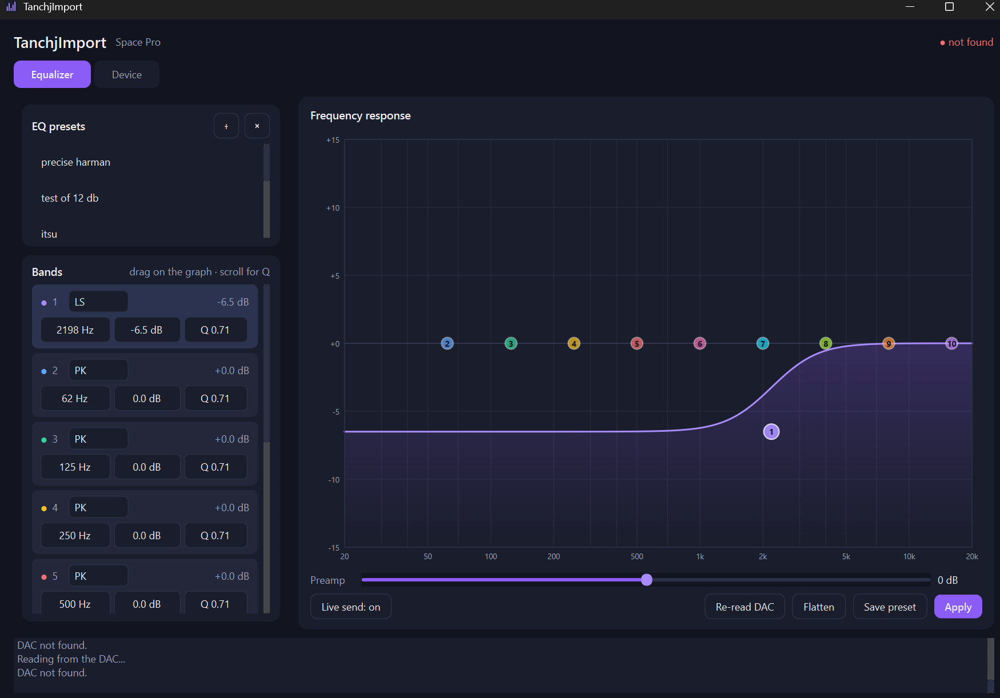

# TanchjImport

A full control app for the **Tanchjim Space Pro** USB DAC.

Import AutoEQ / Wavelet parametric EQ files, edit the ten bands by dragging them on a live response curve, control every hardware setting the DAC exposes, and switch between saved profiles from the Windows system tray.

The official app makes you dial in all ten bands by hand, and hides most of what the firmware can actually do. This doesn't.



*Band 1 is a low shelf and band 4 a high shelf — filter types the official app
won't let you pick. The dashed orange line is the loaded preset, kept on screen
as a reference while you edit.*

> Not affiliated with Tanchjim. Use at your own risk.

---

## What's new in this version

The big one: **the firmware supports seven filter types, not one.** The official app only ever exposes peaking filters, but low shelf, high shelf, low pass, high pass and band pass are all implemented in the device and work exactly as you'd expect. AutoEQ profiles with shelf filters now import natively — the old shelf-to-peak approximation is gone, and good riddance.

Also new:

- **Hardware settings are decoded** — output gain, reconstruction filter, DAC output mode, DRE optimization and microphone gain, each on its own command group.
- **The device can be read back**, not just written to. Direction bit `0x80` returns the current bands, preamp and settings, so the app opens showing what's actually on the DAC.
- **Profiles** store the EQ *and* every hardware setting together, so one click restores a complete state.
- **A real PEQ editor** — drag a band on the graph to move it, scroll to change Q, and the DAC follows in real time.
- Rewritten UI on PySide6 (was customtkinter + pystray).

And one negative result worth recording: **channel balance is not implemented here on purpose.** See the warning below.

## Features

- Loads standard AutoEQ / Wavelet `ParametricEQ.txt` files
- All ten bands, all seven filter types
- Drag-to-edit frequency response graph with the loaded preset overlaid as a reference
- Live send — edits reach the DAC as you make them, debounced
- Reads the current state back off the device on launch
- Named EQ presets, and profiles that bundle EQ + hardware settings
- Tray menu for one-click switching
- Start with Windows, launching hidden in the tray
- Clamps out-of-range values instead of sending garbage to the device

## Install

Download `TanchjImport.exe` from [Releases](../../releases/latest) and run it.
Nothing else needed. It's a big download (~47 MB) because the Qt runtime ships
inside it.

Or run from source:

```powershell
pip install PySide6 hidapi
python tanchjimport.py
```

Build your own `.exe`:

```powershell
pip install pyinstaller
python -m PyInstaller --onefile --noconsole --name "TanchjImport" tanchjimport.py
```

See [BUILD_EXE.md](BUILD_EXE.md) for the longer version.

## Usage

1. Get a PEQ file — [AutoEQ](https://github.com/jaakkopasanen/AutoEq), [peqdb.com](https://peqdb.com), or your own.
2. Hit **+** in the EQ presets panel, pick the file, give it a name.
3. Edit by dragging bands on the graph if you want, then **Apply**.

Presets and profiles live in `%APPDATA%\SpaceProEQ\presets.json` and `profiles.json`. Copy those to move between machines.

Expected file format:

```
Preamp: -5.9 dB
Filter 1: ON PK Fc 20 Hz Gain 1.92 dB Q 1.700
Filter 2: ON LSC Fc 105 Hz Gain 3.50 dB Q 0.700
...
```

Filters past the tenth are ignored. Values outside the device's range are clamped, with a note in the log.

---

## Protocol

Reverse engineered from USB captures (Wireshark + USBPcap) of the official Windows app. Documented here so anyone can build a Linux/macOS/Android/C version.

**Device:** VID `0x3302`, PID `0x4307` — HID, report ID `0x4B`, 64-byte reports.

Every command shares the shape `4B <dir> <group> <len>`, where `dir` is `0x01` to write and `0x80` to read.

### Band set — `4B 01 09 18 00 <band 0-9>`

| Offset | Field | Encoding |
|---|---|---|
| `[5]` | Band index | 0–9 |
| `[8:28]` | Coefficient blob | **Stored but never read by the firmware** — see below |
| `[28:30]` | Frequency | uint16 LE, raw Hz |
| `[30:32]` | Q | uint16 LE, value ÷ 256 |
| `[32:34]` | Gain | int16 LE, value ÷ 256 dB |
| `[34:36]` | Filter type | uint16 LE, see table |
| `[36:38]` | Unknown | we always send 20 |

### Filter types

| Value | Type |
|---|---|
| `0` | Off |
| `1` | Low shelf |
| `2` | Peaking |
| `3` | High shelf |
| `4` | Low pass |
| `5` | High pass |
| `6` | Band pass |

Gain is ignored for off, low pass, high pass and band pass. Only peaking was ever visible in the official app — the rest are firmware features it simply doesn't offer a UI for.

### EQ commands

| Command | Meaning |
|---|---|
| `4B 01 0A 04 00 00 FF FF` | Commit after band writes |
| `4B 01 03 02 00 <int8 dB>` | Master preamp — value is byte `[5]`, whole dB only |
| `4B 01 04 00` | Commit after preamp |
| `4B 01 01 00` | Save / persist, sent at the end of a preset load |
| `4B 80 09 1F 00 <band>` | Read band |
| `4B 80 03 02` | Read preamp — value comes back in byte `[5]` |

Write order used by the official app: 10× band set → band commit → preamp → preamp commit → save.

When reading, check both the group byte `[2]` **and**, for band reads, the band
index `[5]` before trusting a reply. Replies can arrive after you have moved on
to the next request, and a reply for band 0 will otherwise happily masquerade as
band 1.

### Device info and volume

| Command | Returns |
|---|---|
| `4B 80 0C 00` | **Firmware version**, ASCII from `[4]`. Reads `31 2E 31` = `"1.1"` here |
| `4B 80 85 00` | **Current volume** in byte `[4]`. Observed range 0–60 |
| `4B 80 0E 00` | 4-byte id, constant. Serial or build number, unconfirmed |

Volume tracks the system volume slider live, so polling `0x85` gives you a
readout. It is not a percentage — the top of the Windows slider reads 60.

### The device never speaks first

The Space Pro is **strictly request/response**. It sends nothing unprompted:
not on volume change, not on setting change, not on a timer. Verified by
holding the device open for 45 seconds sending nothing at all while the volume
was changed from 60 to 27 — zero reports arrived. Anything live has to be
polled.

A warning for anyone taking captures: on Windows, HID input reports are
delivered to **every** open handle on the device. If the official app is running
while you capture, its poll replies land in your read queue and look exactly
like unsolicited device pushes. They are not. Close it before drawing
conclusions — this cost me an evening.

### Hardware settings

These live in their own command groups and are completely independent of the EQ — writing settings never disturbs the bands, and applying an EQ never disturbs the settings.

| Command | Setting | Values |
|---|---|---|
| `4B 01 19 3C <v>` | Output gain | `0` low (2 Vrms), `1` high (4 Vrms) |
| `4B 01 11 01 <v>` | Reconstruction filter | `1`–`5`, see below |
| `4B 01 1D 3C <v>` | DAC output mode | `0` Class AB, `1` Class H |
| `4B 01 32 01 <v>` | DRE optimization | `0` off, `1` on |
| `4B 01 02 02 <int16 LE>` | Microphone gain | value ÷ 256 dB |

Reconstruction filter values: `1` low latency fast steep descent, `2` fast descent with phase compensation, `3` low latency slow descent, `4` slow descent with phase compensation, `5` non-oversampling.

Each is read back with `4B 80 <group> <len>`. Note the reply layout is not uniform: single-byte settings return the value in byte `[4]`, the int16 mic gain in `[4:6]`, but the preamp reply puts its value in `[5]`.

### About that coefficient blob

Bytes `[8:28]` carry what look like biquad filter coefficients, and they change wildly with every parameter tweak — which sent me down a long rabbit hole trying to match them against the RBJ audio EQ cookbook at various sample rates. Nothing fit.

It turned out not to matter: **zeroing all 20 bytes and sending only frequency, Q, gain and type applies the EQ correctly**, and the official app then displays the new settings.

The field has since been pinned down exactly. It is **passive storage the firmware
round-trips and never reads**:

- Write zeros → zeros read back. If the firmware derived coefficients itself it
  would have replaced them.
- Let the official app write an EQ → its real coefficients read back.
- Write a hand-made identity biquad → it reads back byte-for-byte identical. No
  validation, no recomputation, no clearing.

So the device stores whatever you put there and computes its own filters from
frequency, Q, gain and type regardless. Sending zeros is safe.

The frequency was never encoded in there at all — it's the plain uint16 at `[28:30]`, in raw Hz.

**Structure, for anyone who wants to finish the job.** 20 bytes is exactly
5 × 4-byte values, matching a biquad's `b0, b1, b2, a1, a2`. Bands set to 0 dB
all begin `00 00 00 40` — float32 `2.0` — while a −10 dB band begins
`66 9B E3 3F` = `1.7782`, which is `10^(10/40)`, the shape of a peaking filter's
`A` term. Plain little-endian float32 does not decode the remaining groups
cleanly, so the encoding is mixed or non-standard.

### Verification

- Frequency: 14/14 labeled test points (200 Hz – 20 kHz) plus all 10 factory band defaults (31–16000 Hz)
- Q: typed values 1–5 → exactly 256/512/768/1024/1280; factory default 181 = 0.707
- Gain: ±10 through ±6 dB in 1 dB steps, exact, no rounding error
- Command surface: every group `0x00`–`0xFF` swept at seven different length
  bytes, with replies validated against the requested group. Exactly **16
  groups** answer. Nothing is hidden behind an unusual length.

### The complete readable surface

`0x00`, `0x02`, `0x03`, `0x09`, `0x0C`, `0x0D`, `0x0E`, `0x11`, `0x16`, `0x18`,
`0x19`, `0x1A`, `0x1D`, `0x1E`, `0x32`, `0x85`.

`0x0D`, `0x1A` and `0x00` at longer lengths return blobs containing
`0x4800xxxx`-range addresses and 4-char ASCII tags such as `CPU` and `SPV` —
what an RTOS task or module table looks like. They are **completely static**:
unchanged across 25 seconds of polling under load, and unchanged across EQ
changes. They are not sensors and not an EQ representation. In particular
**there is no temperature reading anywhere on the device.**

---

## Warning: channel balance

Group `0x16` looks like channel balance, and an earlier version of this app implemented it as `4B 01 16 04 <ch> 00 <n>` — channel `0` left, `1` right, `n` attenuation in 0.5 dB steps.

**That decode was wrong, and writing it produced a sudden dangerous volume jump.** It has been removed. Do not put it back without re-verifying against a fresh capture, and do not have anything in your ears when you test it. Use the official app if you need balance.

## Known limits and unknowns

- **Preamp is whole dB only** — a device restriction. `-5.9 dB` is sent as `-6 dB`.
- **±12 dB gain clamp is a guess.** Captures only ever proved ±10 dB.
- **Group `0x16` (channel balance) is mis-decoded and dangerous.** See above.
- **Groups `0x18` and `0x1E` are unidentified.** Both return a single `01`, the
  same shape as the known toggles like `0x19` and `0x32`, so they are probably
  settings. Identifying them needs writes, which I have not risked.
- **`[36:38]` is unexplained.** Varies by context with no observed audible effect.
- **`4B 01 01 00`** is assumed to be save/persist; not conclusively confirmed.
- **The coefficient encoding in `[8:28]` is only half solved.** See above.
- Tested on **one unit, Windows only, firmware 1.1** (read it yourself with
  `4B 80 0C 00`). Reports from other units and firmware versions welcome —
  please include your version.

## Contributing

Issues and PRs welcome — especially from other Space Pro owners. Filling in the unknowns above, or confirming behaviour on different firmware, would be the most useful thing.

## License

MIT

## Credits

Protocol reverse-engineered by [@themarkly](https://github.com/themarkly). Implementation written with AI assistance.
